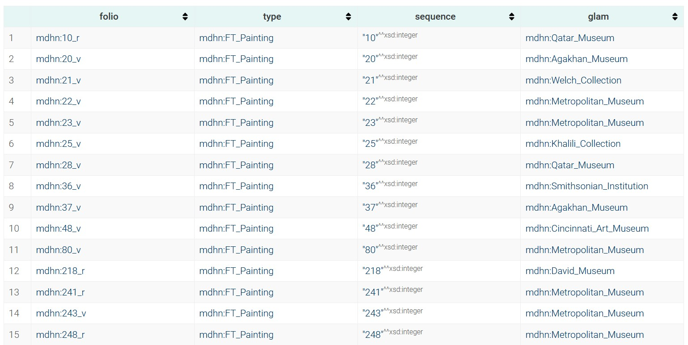

# Shah Tahmasp Shahnama (Houghton) Ontology and Controlled Vocabulary

## Overview

This repository hosts the first version of a custom ontology and controlled vocabulary for describing Persian manuscripts, with a focus on the dispersed Houghton Shahnama (Shah Tahmasp Shahnama). The ontology is designed to cover aspects such as manuscript structure, folios (equivalent to IIIF Canvases), miniature paintings, narrative sequences, agential roles, and cultural specifics. It is built on CIDOC-CRM for compatibility with Linked Art and LOUD principles, enabling reconciliation with AAT, TGN, and Wikidata.

The controlled vocabulary provides a minimal set of terms for classifying folio types (e.g., Painting, Colophon), which can be associated with folios via the `:hasFolioType` property.

This initial release includes:
- The ontology in Turtle (TTL) format.
- A standalone controlled vocabulary (`folio-types-controlled-vocabularies.ttl`) as part of the ontology.
- Sample RDF data for a few folios.
- SPARQL query examples for demonstration.
- A JSON catalog (`catalog.json`) of resources (folios and paintings) to be considered for integration and upload to Internet Archive (IA). This catalog is partial and focuses on publicly accessible digitized folios; expand it as needed.

The project aims to facilitate a virtual reconstruction of the manuscript using IIIF, with metadata in RDF for LOD interoperability.


## Repository Structure Recommendations

For the first version, keep the structure simple and focused on the ontology and vocabulary. As the project grows, add metadata for individual folios and IIIF manifests. Use Git for version control, with semantic versioning (e.g., v1.0.0 for this release).

Recommended file structure:

```
houghton-shahnama-ontology/
├── ontology/
│   └── persian-manuscript-ontology.ttl  # Core ontology and controlled vocabulary in Turtle
├── ia/
│   └── upload_to_ia.py # Uploader to Internet Archive 
├── sample-images/
│   └── ...
├── examples/
│   ├── sample-folio-rdf/
│   │   ├── folio-22v.ttl  # Sample RDF for "The Feast of Sada" (Folio 22v)
│   │   ├── folio-61b.ttl  # Sample for "Birth of Zal" (Folio 61b)
│   │   └── folio-248r.ttl # Sample for "Giv Avenges Bahram" (Folio 248r)
│   └── sparql-queries/
│       ├── query-folios-by-type.sparql   # Example SPARQL files
│       ├── query-artist-attributions.sparql
│       └── query-narrative-sequences.sparql
├── resources/
│   └── catalog.json  # JSON catalog of resources for IA integration
├── docs/
│   ├── ontology-documentation.md  # Detailed docs on classes, properties, and usage
│   └── reconciliation-guide.md   # Guide for mapping to AAT/TGN/Wikidata
├── LICENSE  # CC0 1.0 for metadata/ontology
├── README.md  # This file
└── .gitignore
```

- **/ontology**: Core TTL file. Use Protégé for editing/validation.
- **/examples**: Sample data and queries to demonstrate usage. Load into a triple store like Apache Jena Fuseki for testing.
- **/resources**: The JSON catalog for folios/resources. This serves as an index for gathering originals before creating IIIF manifests and uploading to IA.
- **/docs**: Supplementary Markdown docs for usability (LOUD compliance).
- **Future Expansions**: Add `/metadata` for full RDF per folio, `/iiif` for manifests/collections, and `/scripts` for automation (e.g., Python with RDFLib for generating RDF from CSV).

Publish as a public GitHub repo (e.g., github.com/MehranDHN/houghton-shahnama-ontology). Use GitHub Pages for a simple site hosting docs and a SPARQL endpoint demo if possible.

## Usage

1. **Load the Ontology**: Import `persian-manuscript-ontology.ttl` into tools like Protégé or RDF stores.
2. **Reconciliation**: Use OpenRefine to map properties (e.g., `:materials` to AAT URIs).
3. **Querying**: Set up a local SPARQL endpoint with Fuseki. Load samples and run queries.
4. **JSON Catalog**: Use `catalog.json` to script downloads/IIIF imports. For IA, adapt metadata to DC/MODS and upload images with IIIF support.
5. **Extensions**: For full project, generate IIIF Collection JSON linking to external manifests (e.g., Met's IIIF endpoints).

## SPARQL Query Examples

Below are example SPARQL queries demonstrating query possibilities. Assume the ontology namespace `@prefix pmo: <http://MehranDHN.org/pmo#> .` and samples loaded. These can be run in a tool like Fuseki or Yasgui.

### 1. Retrieve All Painting Folios , Foilio's sequence and GLAM order by Seq 
```
PREFIX skos: <http://www.w3.org/2004/02/skos/core#>
PREFIX onto:<http://www.ontotext.com/>
PREFIX mdhn:<http://example.com/mdhn/>
PREFIX :<http://example.com/mdhn/>
SELECT ?folio ?type ?sequence ?glam
WHERE {
  ?folio a :Folio ;
         :hasFolioType ?type ;
         :keptInGLAM ?glam;
         :sequencePosition ?sequence .
  FILTER (?type = :FT_Painting)  
}
ORDER BY ?sequence
```
- **Purpose**: Lists folios by specified FolioType, with folio sequence and GLAM(publisher)
- **Expected Output** 


### 2. Find Folios Attributed to a Specific Artist
```
PREFIX pmo: <http://MehranDHN.org/pmo#>
PREFIX rdfs: <http://www.w3.org/2000/01/rdf-schema#>

SELECT ?folio ?painting ?artistLabel ?scene
WHERE {
  ?folio a pmo:Folio ;
         pmo:hasRecto|pmo:hasVerso ?painting .
  ?painting a pmo:MiniaturePainting ;
            pmo:attributedTo ?artist ;
            pmo:depictsScene ?episode .
  ?episode rdfs:label ?scene .
  ?artist rdfs:label ?artistLabel .
  FILTER (CONTAINS(?artistLabel, "Sultan Muhammad"))  # Example artist
}
```
- **Purpose**: Queries for attributions, useful for agential analysis in Safavid art.
- **Expected Output**: Folios like 22v attributed to Sultan Muhammad, depicting "The Feast of Sada".
- **Very Big Problem**: Obviously this kind of query is based on exact match keyword search, even if we use `REGEX` like services. Without a  `Thesaurus`and `Reconciliation` of the resources, among other issues is waste of time and resources and achieving %100 accuracy will be impossible.
```
SELECT ?folio ?typeLabel ?sequence ?episodeLabel ?character
WHERE {
  ?folio a pmo:Folio ;
         pmo:hasFolioType ?type ;
         pmo:sequencePosition ?sequence ;
         pmo:hasRecto|pmo:hasVerso ?painting .
  ?type skos:prefLabel ?typeLabel .
  ?painting pmo:depictsScene ?episode ;
            pmo:depictsCharacter ?char .
  ?episode rdfs:label ?episodeLabel .
  ?char crm:P2_has_type ?character .
  FILTER (?type = pmo:Painting)
}
ORDER BY ?sequence
```
- **Purpose**: Traces Shahnama narrative across folios, linking to characters (e.g., Zal via Wikidata).
- **Expected Output**: Folio 61b (sequence 61, "Birth of Zal", character "Zal").

### 4. List Folios by Current Location (Reconciled to TGN)
```
PREFIX pmo: <http://MehranDHN.org/pmo#>

SELECT ?folio ?location ?description
WHERE {
  ?folio a pmo:Folio ;
         pmo:currentLocation ?loc ;
         rdfs:comment ?description .  # Optional desc
  ?loc rdfs:label ?location .
  FILTER (?loc = <http://vocab.getty.edu/tgn/7007567>)  # New York (Met)
}
```
- **Purpose**: Filters by provenance/location for dispersal tracking.
- **Expected Output**: Met folios in New York.

These examples showcase sequence handling, agential/subject queries, and reconciliation. For production, host a SPARQL endpoint and add more complex queries (e.g., with GRAPH for federated data).

## JSON Catalog of Resources

The `catalog.json` file in `/resources` is a starting point for cataloging dispersed folios. It includes publicly digitized ones from major institutions. Each entry has:
- `title`: Descriptive title (e.g., "Folio X: Scene").
- `source_url`: URL to the publisher's page/digital object.
- `metadata`: Object with min fields like accession, date, medium, dimensions, location.
- `description`: Optional narrative/scene/provenance info.

This is partial (focusing on ~20 known folios); expand via scripts scraping Met API, Cambridge DL, etc. Use it to fetch resources for IIIF integration and IA upload (adapt to IA's metadata requirements).

Sample `catalog.json` content (as JSON string for illustration; save as file):

```json
[
  {
    "title": "Folio 22v: The Feast of Sada",
    "source_url": "https://www.metmuseum.org/art/collection/search/452111",
    "metadata": {
      "accession": "1970.301.2",
      "has_content_type": ["MiniaturePainting", "TextBlock"],
      "folio_sequence": 22,
      "folio_side": "v",
      "folio_type" : ["Painting"], 
      "date": "ca. 1525",
      "script_style" : "aat:300265532",
      "medium": "Opaque watercolor, ink, silver, and gold on paper",
      "dimensions": "Painting: 9 1/2 x 9 1/16 in. (24.1 x 23 cm); Page: 18 1/2 x 12 1/2 in. (47 x 31.8 cm)",
      "location": "Metropolitan Museum"
    },
    "description": "Depicts the ancient festival of Sada with fire and celebration; attributed to Sultan Muhammad."
  },
  {
    "title": "Folio 265v: Combat of Giv and Kamus",
    "source_url": "https://www.vmfa.museum/artworks/page-from-the-houghton-shahnama-the-combat-of-giv-and-kamus-83386",
    "metadata": {
      "accession": "78.121",
      "has_content_type": ["MiniaturePainting", "TextBlock"],
      "folio_sequence": 265,
      "folio_side": "v",
      "folio_type" : ["Painting"],
      "date": "ca. 1525-1535",
      "script_style" : "aat:300265532",
      "medium": "Ink, opaque watercolor, and gold on paper",
      "dimensions": "Approx. 47.31 × 32.07 cm",
      "location": "Virginia Museum of Fine Arts"
    },
    "description": "This painting depicts the combat between the Iranian hero Giv and Kamus of Kashan. It shows the moment when, surrounded by their opposing armies, Giv’s lance was “cleaved obliquely like a pen."
  },
  {
    "title": "Folio 23v: Tahmuras Defeats the Divs",
    "source_url": "https://www.metmuseum.org/art/collection/search/452112",
    "metadata": {
      "accession": " 1970.301.3",
      "has_content_type": ["MiniaturePainting", "TextBlock"],
      "folio_sequence": 23,
      "folio_side": "v",
      "folio_type" : ["Painting"],
      "date": "ca. 1525",
      "script_style" : "aat:300265532",
      "medium": "Opaque watercolor, ink, silver, and gold on paper",
      "dimensions": "Painting: 9 1/2 x 9 1/16 in. (24.1 x 23 cm); Page: 18 1/2 x 12 1/2 in. (47 x 31.8 cm)",
      "location": "Metropolitan Museum"
    },
    "description": "Tahmuras, shown here galloping across a meadow, defeated the divs (demons); in exchange for their lives, they taught him the art of writing. This work is attributed to Sultan Muhammad, the master painter and chief administrator of the first generation of artists of this manuscript"
  },  
  {
    "title": "Folio 241r: The Besotted Iranian Camp Attacked by Night",
    "source_url": "https://www.metmuseum.org/art/collection/search/452145",
    "metadata": {
      "accession": "1970.301.29",
      "has_content_type": ["MiniaturePainting", "TextBlock"],
      "folio_sequence": 241,
      "folio_side": "r",
      "folio_type" : ["Painting"],
      "date": "ca. 1525",
      "script_style" : "aat:300265532",
      "medium": "Opaque watercolor, ink, and gold on paper",
      "dimensions": "Painting: 11 x 9 in. (27.9 x 22.9 cm); Page: 18 1/2 x 12 1/2 in. (47 x 31.8 cm)",
      "location": "Metropolitan Museum"
    },
    "description": "Night attack scene from Turano-Iranian wars."
  },
  {
    "title": "Folio 243v: The Battle of Pashan Begins",
    "source_url": "https://www.metmuseum.org/art/collection/search/452146",
    "metadata": {
      "accession": "1970.301.30",
      "has_content_type": ["MiniaturePainting", "TextBlock"],
      "folio_sequence": 243,
      "folio_side": "v",
      "folio_type" : ["Painting"],
      "date": "ca. 1525",
      "script_style" : "aat:300265532",
      "medium": "Opaque watercolor, ink, and gold on paper",
      "dimensions": "Painting: 11 1/4 x 9 1/8 in. (28.6 x 23.2 cm); Page: 18 1/2 x 12 1/2 in. (47 x 31.8 cm)",
      "location": "Metropolitan Museum"
    },
    "description": "Battle commencement with warriors."
  },
  {
    "title": "Folio 248r: Giv Avenges Bahram by Slaying Tazhav",
    "source_url": "https://www.metmuseum.org/art/collection/search/452148",
    "metadata": {
      "accession": "1970.301.32",
      "has_content_type": ["MiniaturePainting", "Illumination", "TextBlock"],
      "folio_sequence": 248,
      "folio_side": "r",
      "folio_type" : ["Painting"],
      "date": "ca. 1525",
      "script_style" : "aat:300265532",
      "medium": "Opaque watercolor, ink, and gold on paper",
      "dimensions": "Painting: 11 1/8 x 9 1/8 in. (28.3 x 23.2 cm); Page: 18 1/2 x 12 1/2 in. (47 x 31.8 cm)",
      "location": "Metropolitan Museum"
    },
    "description": "Combat scene; vengeance narrative."
  },
  {
    "title": "Folio 28v: The Nightmare of Zahhak",
    "source_url": "https://collections.qm.org.qa/en/objects/the-nightmare-of-zahhak-ms412007",
    "metadata": {
      "accession": "ms412007",
      "has_content_type": ["MiniaturePainting", "TextBlock"],
      "folio_sequence": 28,
      "folio_side": "v",
      "folio_type" : ["Painting"],
      "highres_image": "https://minicomp.github.io/wax/img/derivatives/iiif/images/obj7/full/full/0/default.jpg",
      "date": "ca. 1525-1535",
      "script_style" : "aat:300265532",
      "medium": "Opaque watercolor, ink, and gold on paper",
      "dimensions": "47.2 × 32.1 cm cm",
      "location": "Qatar Museum"
    },
    "description": "The Nightmare of Zahhak"
  },
  {
    "title": "Folio 80v: Manuchihr Welcomes Sam but Orders War upon Mihrab",
    "source_url": "https://www.metmuseum.org/art/collection/search/452118",
    "metadata": {
      "accession": "1970.301.9",
      "has_content_type": ["MiniaturePainting", "TextBlock"],
      "folio_sequence": 80,
      "folio_side": "v",
      "folio_type" : ["Painting"],
      "date": "ca. 1525",
      "script_style" : "aat:300265532",
      "medium": "Opaque watercolor, ink, silver, and gold on paper",
      "dimensions": "Painting: 9 1/2 x 9 1/16 in. (24.1 x 23 cm); Page: 18 1/2 x 12 1/2 in. (47 x 31.8 cm)",
      "location": "Metropolitan Museum"
    },
    "description": "Sam arrived at the imperial court and was received by Shah Manuchihr, who listened with admiration as he reported on the victories and adventures of the campaign"
  },
  {
    "title": "Folio 708v: The Angel Surush Rescues Khusrau Parviz",
    "source_url": "https://www.metmuseum.org/art/collection/search/452182",
    "metadata": {
      "accession": " 1970.301.73",
      "has_content_type": ["MiniaturePainting", "TextBlock"],
      "folio_sequence": 708,
      "folio_side": "v",
      "folio_type" : ["Painting"],
      "date": "ca. 1530",
      "script_style" : "aat:300265532",
      "medium": "Opaque watercolor, ink, and gold on paper",
      "dimensions": "Painting: 11 x 9 in. (27.9 x 22.9 cm); Page: 18 1/2 x 12 1/2 in. (47 x 31.8 cm)",
      "location": "Metropolitan Museum"
    },
    "description": "Rescue scene with angel intervention."
  },
  {
    "title": "Folio 48v: Tur Beheads Iraj",
    "source_url": "https://www.cincinnatiartmuseum.org/art/explore-the-collection?id=24210695&title=Tur-Beheads-Iraj;-Page-from-a-Dispersed-copy-of-the-Shahnama-Book-of-Kings-by-Firdawsi",
    "metadata": {
      "accession": "1984.87",
      "has_content_type": ["MiniaturePainting", "TextBlock"],
      "folio_sequence": 48,
      "folio_side": "v",
      "folio_type" : ["Painting"],
      "highres_image": "https://artsandculture.google.com/asset/tur-beheads-iraj-sultan-muhammad-iranian-attributed/IQGB-i0WnXtGxw",
      "date": "ca. 1530",
      "script_style" : "aat:300265532",
      "medium": "Ink, opaque watercolor, and gold on paper",
      "dimensions": "32.7 x 23.8 cm",
      "location": "Cincinnati Art Museum"
    },
    "description": "Earthly drunkenness scene; stylistic link to Houghton Shahnama."
  },
  {
    "title": "Folio 218r: Kay Khusraw Welcomed by his Grandfather, Kay Kaus, King of Iran",
    "source_url": "https://www.davidmus.dk/art-from-the-islamic-world/miniature-paintings/item/963?culture=en-us",
    "metadata": {
      "accession": "30/1988",
      "has_content_type": ["MiniaturePainting","Illumination", "TextBlock"],
      "folio_sequence": 218,
      "folio_side": "r",
      "folio_type" : ["Painting"],
      "highres_image": "https://catalog.cdn-davidmus.dk/storage/representations/proxy/eyJfcmFpbHMiOnsibWVzc2FnZSI6IkJBaHBBdThFIiwiZXhwIjpudWxsLCJwdXIiOiJibG9iX2lkIn19--161d369b711d51196b776544384e49cc8dc6634b/eyJfcmFpbHMiOnsibWVzc2FnZSI6IkJBaDdCem9MWm05eWJXRjBTU0lJYW5CbkJqb0dSVlE2RkhKbGMybDZaVjkwYjE5c2FXMXBkRnNIYVFJQUNta0NBQW89IiwiZXhwIjpudWxsLCJwdXIiOiJ2YXJpYXRpb24ifX0=--2fb0a7ed0031bd5615b9bf0a5ecfe18c7e2c74ed/Copyright_the_David-Collection_Copenhagen_30-1988_photo_Pernille_Klemp_web.jpg",
      "date": "ca. 1530",
      "script_style" : "aat:300265532",
      "medium": "Ink, opaque watercolor, and gold on paper",
      "dimensions": "47.6 x 32.1 cm",
      "wd_entity" : "Q105732037",
      "location": "David Museum"
    },
    "description": "The scene is enacted at the court of Kay Kaus. He is seated on his throne together with his grandson, Kay Khusraw, who has just returned from Turan, where he grew up in secrecy after his father, good Prince Siyawush, was killed."
  },
  {
    "title": "Folio 521v: Haftvad and the Worm",
    "source_url": "https://collections.agakhanmuseum.org/collection/artifact/story-haftvad-and-the-worm-akm164",
    "metadata": {
      "accession": "AKM164",
      "has_content_type": ["MiniaturePainting", "TextBlock"],
      "folio_sequence": 521,
      "folio_side": "v",
      "folio_type" : ["Painting"],
      "date": "ca. 1530",
      "script_style" : "aat:300265532",
      "medium": "Ink, opaque watercolor, and gold on paper",
      "dimensions": "46.8 x 32.3 cm",
      "location": "Agakhan Museum"
    },
    "description": "It has been argued that “The Death of Zahhak” dates to around 1535 and is Sultan Muhammad’s last contribution to the Shahnameh (Book of Kings) of Shah Tahmasp (folio 37 verso). By the mid-1530s, the style of Safavid court painting had matured, and some of the hallmarks of Sultan Muhammad’s own idiom had evolved. "
  },
  {
    "title": "Folio 25v: The Death of King Mirdas",
    "source_url": "https://www.khalilicollections.org/collections/islamic-art/khalili-collection-islamic-art-the-death-of-king-mirdas-mss1030-folio25/",
    "metadata": {
      "accession": "MSS 1030, folio 25v",
      "has_content_type": ["MiniaturePainting", "Illumination", "TextBlock"],
      "folio_sequence": 25,
      "folio_side": "v",
      "folio_type" : ["Painting"],
      "date": "ca. 1530",
      "script_style" : "aat:300265532",
      "medium": "Ink, opaque watercolor, and gold on paper",
      "dimensions": "23.3 x 17.5 cm",
      "location": "Khalili Collection"
    },
    "description": "The Death of King Mirdas’, Folio 25 from the Shahnamah of Shah Tahmasp"
  },
  {
    "title": "Folio 25r: The Death of King Mirdas",
    "source_url": "https://www.khalilicollections.org/collections/islamic-art/khalili-collection-islamic-art-the-death-of-king-mirdas-mss1030-folio25/",
    "metadata": {
      "accession": "MSS 1030, folio 25r",
      "has_content_type": ["Illumination", "TextBlock"],
      "folio_sequence": 25,
      "folio_side": "r",
      "folio_type" : ["Illuminated_Heading_Text"],
      "date": "ca. 1530",
      "script_style" : "aat:300265532",
      "medium": "Ink, opaque watercolor, and gold on paper",
      "dimensions": "27 x 17.1 cm",
      "location": "Khalili Collection"
    },
    "description": "The Death of King Mirdas’, Folio 25 from the Shahnamah of Shah Tahmasp"
  },
  {
    "title": "Folio 21v: Hushang Slays the Black Div",
    "source_url": "https://commons.wikimedia.org/wiki/File:Hushang_Slays_the_Black_Div,_from_the_Shah_Tahmasp%27s_Shahnama.jpg",
    "metadata": {
      "accession": "Welch folio 21v",
      "has_content_type": ["MiniaturePainting", "Illumination", "TextBlock"],
      "folio_sequence": 21,
      "folio_side": "v",
      "folio_type" : ["Painting"],
      "date": "ca. 1530",
      "script_style" : "aat:300265532",
      "medium": "Ink, opaque watercolor, and gold on paper",
      "dimensions": "321 x 215 mm",
      "wd_entity" : "Q131281679",
      "location": "Welch Collection"
    },
    "description": "Hushang Slays the Black Div, from the Shah Tahmasp's Shahnama, f. 21v. Attributed to Soltan Mohammad. 321 x 215 mm. Tabriz, c. 1522-1530. The Welch Collection"
  },
  {
    "title": "Folio 36v: Faridun strikes Zahhak with the ox-headed mace",
    "source_url": "https://asia.si.edu/explore-art-culture/collections/search/edanmdm:fsg_F1996.2/",
    "metadata": {
      "accession": "F1996.2",
      "has_content_type": ["MiniaturePainting", "TextBlock"],
      "folio_sequence": 36,
      "folio_side": "v",
      "folio_type" : ["Painting"],
      "highres_image":"https://ids.si.edu/ids/iiif/FS-7883_04/full/full/0/default.jpg",
      "date": "ca. 1530",
      "script_style" : "aat:300265532",
      "medium": "Ink, opaque watercolor, and gold on paper",
      "dimensions": "27.2 × 17.4 cm",
      "location": "Smithsonian Institution"
    },
    "description": "The hero Feridun enters the story towards the beginning, when the evil king Zahak dreams that Feridun would strike him down with an ox-headed mace and put an end to his reign of darkness. Feridun, whose father had been killed by Zahak, wages various campaigns against the tyrant and even manages to enthrone himself in Zahak's castle"
  },
  {
    "title": "Folio 36r: Faridun captures Zahhak",
    "source_url": "https://asia.si.edu/explore-art-culture/collections/search/edanmdm:fsg_F1996.2/",
    "metadata": {
      "accession": "F1996.2",
      "has_content_type": ["Illumination", "TextBlock"],
      "folio_sequence": 36,
      "folio_side": "r",
      "folio_type" : ["Illuminated_Text"],
      "highres_image":"https://ids.si.edu/ids/iiif/FS-6838_09/full/full/0/default.jpg",
      "date": "ca. 1530",
      "script_style" : "aat:300265532",
      "medium": "Ink, opaque watercolor, and gold on paper",
      "dimensions": "27.2 × 17.4 cm",
      "location": "Smithsonian Institution"
    },
    "description": "The hero Feridun enters the story towards the beginning, when the evil king Zahak dreams that Feridun would strike him down with an ox-headed mace and put an end to his reign of darkness. Feridun, whose father had been killed by Zahak, wages various campaigns against the tyrant and even manages to enthrone himself in Zahak's castle"
  },
  {
    "title": "Folio 37v: The Death of Zahhak",
    "source_url": "https://collections.agakhanmuseum.org/collection/artifact/the-death-of-zahhak-akm155",
    "metadata": {
      "accession": "AKM155",
      "has_content_type": ["MiniaturePainting", "TextBlock"],
      "folio_sequence": 37,
      "folio_side": "v",
      "folio_type" : ["Painting"],
      "date": "ca. 1530",
      "script_style" : "aat:300265532",
      "medium": "Ink, opaque watercolor, and gold on paper",
      "dimensions": "46.8 x 32.3 cm",
      "location": "Agakhan Museum"
    },
    "description": "AKM155 (folio 37 verso) depicts the terrible fate of Zahhak, who, as a young man, came under the spell of the evil Ahriman. Ahriman appeared to Zahhak in the form of a congenial fellow and convinced Zahhak to murder his father, an Arabian king. Once Zahhak had taken control of his father’s lands, Ahriman reappeared in a different guise, this time as a cook."
  },
  {
    "title": "Folio 20v: The Court of Kayumars",
    "source_url": "https://collections.agakhanmuseum.org/collection/artifact/court-of-kayumars-akm165",
    "metadata": {
      "accession": "AKM155",
      "has_content_type": ["MiniaturePainting", "TextBlock"],
      "folio_sequence": 20,
      "folio_side": "v",
      "folio_type" : ["Painting"],
      "date": "ca. 1530",
      "script_style" : "aat:300265532",
      "medium": "Ink, opaque watercolor, and gold on paper",
      "dimensions": "45 x 30 cm",
      "location": "Agakhan Museum"
    },
    "description": "According to Firdausi, the very idea of kingship originated with King Kayumars, who ruled for thirty years, overseeing a peaceable kingdom in which men wore leopard-skin robes and wild animals grew tame. In this utopia Kayumars had one secret enemy, the evil Ahriman, whose envy drove him to incite his own son, the Black Div, to murder Siyamak, the son of Kayumars. Before the assassination took place, the angel Surush warned Kayumars of Ahriman’s plot."
  },
  {
    "title": "Folio 10r: The poet Firdausi reciting from his work before the Ghaznavid sultan Mahmud",
    "source_url": "https://artsandculture.google.com/asset/wd/kAEywduHCF34GA",
    "metadata": {
      "accession": "MIK I 5.82",
      "has_content_type": ["MiniaturePainting", "TextBlock"],
      "folio_sequence": 10,
      "folio_side": "r",
      "folio_type" : ["Painting"],
      "date": "ca. 1530",
      "script_style" : "aat:300265532",
      "medium": "Ink, opaque watercolor, and gold on paper",
      "dimensions": "45 x 30 cm",
      "location": "Qatar Museum"
    },
    "description": "The poet Firdausi reciting from his work before the Ghaznavid sultan Mahmud. Folio from the 'Shahnameh of Shah Tahmasp'. Tabriz, c. 1525. "
  }
]
```

Each record in catalog is used to create a single standalone image resource in Internet Archive.
The final integration of these resources will be create as an on the fly IIIF Manifest.
[Collection of the resources](https://archive.org/search?query=genre%3A%22Shahnama+Shah+Tahmasp%22)

## Scoped Controlled Vocabularies
Despite the lack of standard global controlled vocabulary related to numerous folio types in Persian manuscripts this controlled vocabulary provides a minimal set of terms for classifying folio types (e.g., Painting, Colophon), which can be associated with folios via the :hasFolioType property. A standalone minimal version of this vocabulary is included to ensure precise classification of folio functions in Persian manuscripts.
However there is a complete version in `KG4OPennResources` project that can be refrenced later.

```turtle
@prefix : <http://mehrandhn.org/pmo#> .
@prefix owl: <http://www.w3.org/2002/07/owl#> .
@prefix rdf: <http://www.w3.org/1999/02/22-rdf-syntax-ns#> .
@prefix rdfs: <http://www.w3.org/2000/01/rdf-schema#> .
@prefix crm: <http://www.cidoc-crm.org/cidoc-crm/> .
@prefix xsd: <http://www.w3.org/2001/XMLSchema#> .
@prefix skos: <http://www.w3.org/2004/02/skos/core#> .
@prefix dct: <http://purl.org/dc/terms/> .
@prefix mdhn: <http://mehrandhn.org/pmo#> .


# Controlled Vocabulary for Folio Types (Standalone Minimal Scheme)
:FolioTypeScheme a skos:ConceptScheme ;
    rdfs:label "Folio Type Vocabulary" ;
    rdfs:comment "A minimal controlled vocabulary for classifying types of folios in Persian manuscripts, such as covers, paintings, etc. Each Folio can have one or more types." ;
    dct:creator "Houghton Shahnama Project" .

:Cover a :FolioType ;
    skos:prefLabel "Cover"@en ;
    skos:definition "The protective outer layer or binding of the manuscript."@en ;
    skos:inScheme :FolioTypeScheme .

:IlluminatedOpeningPage a :FolioType ;
    skos:prefLabel "Illuminated Opening Page"@en ;
    skos:definition "A frontispiece or opening folio with elaborate illumination, such as a shamsa (rosette) or sarlauh (headpiece) in Persian manuscripts."@en ;
    skos:inScheme :FolioTypeScheme .

:OwnersAnnotation a :FolioType ;
    skos:prefLabel "Owners Annotation"@en ;
    skos:definition "A folio containing notes, seals, or inscriptions from previous owners (e.g., ex libris or provenance marks)."@en ;
    skos:inScheme :FolioTypeScheme .

:Painting a :FolioType ;
    skos:prefLabel "Painting"@en ;
    skos:definition "A folio featuring a primary miniature painting or illustration."@en ;
    skos:inScheme :FolioTypeScheme .

:Illumination a :FolioType ;
    skos:prefLabel "Illumination"@en ;
    skos:definition "A folio with decorative elements like goldwork, borders, or marginal illuminations, often without a central painting."@en ;
    skos:inScheme :FolioTypeScheme .

:Colophon a :FolioType ;
    skos:prefLabel "Colophon"@en ;
    skos:definition "A folio with the scribe's note at the end, including details like date, place, and creator."@en ;
    skos:inScheme :FolioTypeScheme .

:Flyleaf a :FolioType ;
    skos:prefLabel "Flyleaf"@en ;
    skos:definition "Blank or minimally decorated pages at the beginning or end of the manuscript (also known as fly pages or endpapers)."@en ;
    skos:inScheme :FolioTypeScheme .

# Additional minimal types for completeness in Persian manuscripts
:Finispiece a :FolioType ;
    skos:prefLabel "Finispiece"@en ;
    skos:definition "An illuminated closing page or tailpiece at the end of the manuscript."@en ;
    skos:inScheme :FolioTypeScheme .

:TextFolio a :FolioType ;
    skos:prefLabel "Text Folio"@en ;
    skos:definition "A standard folio primarily containing calligraphic text without major illustrations."@en ;
    skos:inScheme :FolioTypeScheme .

:Illuminated_Text a :FolioType ;
    skos:prefLabel "Illuminated Text"@en ;
    skos:definition "Illuminated Heading Text folio primarily containing calligraphic text with major illumination"@en ;
    skos:inScheme :FolioTypeScheme .  

:Illuminated_Heading_Text a :FolioType ;
    skos:prefLabel "Illuminated Heading Text folio primarily containing calligraphic text with major illumination and heading."@en ;
    skos:inScheme :FolioTypeScheme .   
```

## Final Step. Eventually Integrating the scattered resources.
After uploading each individual resource to Internet Archive, we can access to `IIIF Manifest` of each resource and then using a simple automation we can create a single standalone on the fly IIIF Manifest which contain all resources integrated in proper order with a useful Table of contents guide.


- [Final result using Mirador hosted in Biblissima](https://iiif.biblissima.fr/mirador3/?iiif-content=https://raw.githubusercontent.com/MehranDHN/Houghton-Shahnama/refs/heads/main/IIIF/combined_Shahnama_Shah_Tahmasp.json)


- [Final result using Mirador](https://projectmirador.org/embed/?iiif-content=https://raw.githubusercontent.com/MehranDHN/Houghton-Shahnama/refs/heads/main/IIIF/combined_Shahnama_Shah_Tahmasp.json)


- [Final result using Glycerine](https://demo.viewer.glycerine.io/viewer?iiif-content=https://raw.githubusercontent.com/MehranDHN/Houghton-Shahnama/refs/heads/main/IIIF/combined_Shahnama_Shah_Tahmasp.json)


- [Final result using Universal Viewer](https://uv-v4.netlify.app/#?manifest=https://raw.githubusercontent.com/MehranDHN/Houghton-Shahnama/refs/heads/main/IIIF/combined_Shahnama_Shah_Tahmasp.json&c=&m=&cv=&xywh=-2977%2C-331%2C10168%2C6614)

## License

This ontology and vocabulary are released under CC0 1.0 Universal (CC0 1.0) Public Domain Dedication. Attribute sources for original resources.

## Contributions

Fork and PR for extensions. Issues for bugs/suggestions. Contact for collaboration on full metadata population.

---
*Generated on Sep 15, 2025, by **MehranDHN**, powered by: Grok 3 (xAI).*
